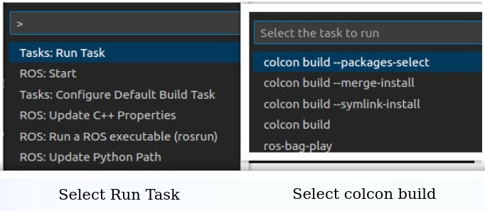

# ros_vscode_config

Checkout the article [Unlocking Enhanced Development Experience: Creating Custom Configurations for VS Code Extensions](https://www.theroboticsspace.com/) at [The Robotics Space](https://www.theroboticsspace.com/).

Follow the steps for initial setup:
- Open the workspace ```vscode_ros2_test_ws``` in VS Code.
- To build the workspace in VS Code, use ```(CTRL + Shift + P)```, select ```Tasks: Run Task``` and then select the ```colcon build``` task from the available options.

<div align="center">

</div>
